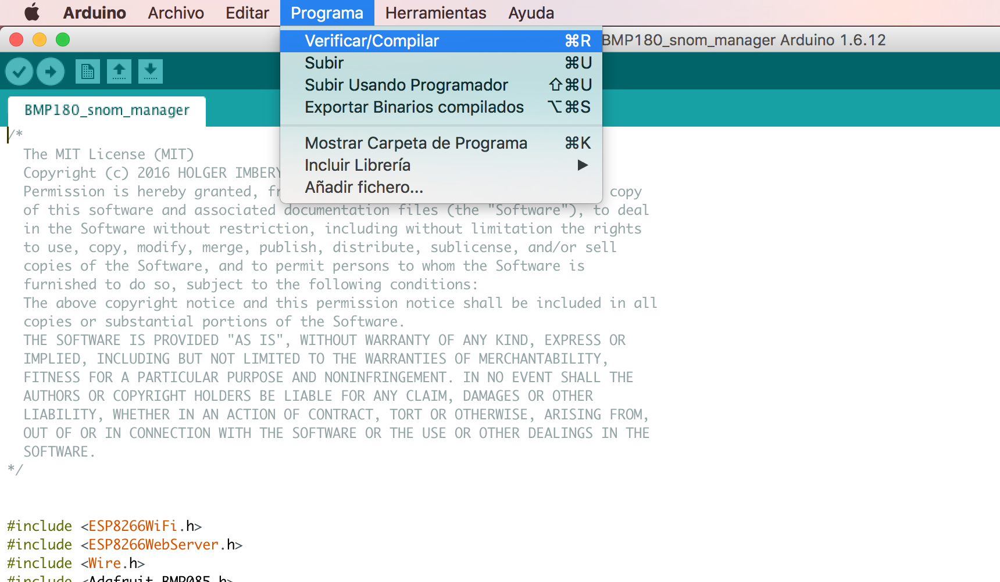
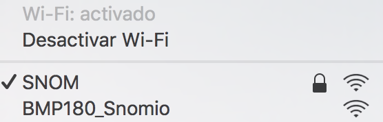
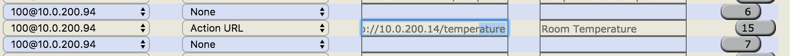

# BMP180 Temperature Sensor XML Application for Snom Phones

## Concept

The application runs on a ESP8266 Device. 

This device has several inputs/outputs that could be used to connect sensors, as BMP180, to meassure temperature or altitude.

## Devices Needed

** WEMOS D1 MINI

** BMP180 Shield

** Snom Phone (any supports XML Browser)

### Arduino IDE Envirionment

1) In order to flash application you need to load .ino file into Arduino IDE software.
  

2) Once you loaded it you need to select device and apply on program. By default Application without previosly configuration creates a WIFI SSID Name called BMP180_Snomio .

  

3) You must connect to this BMP180_Snomio and you will be prompted to select your WIFI. Once you enter your SSID and PASSWORD device is connected to your WIFI network. You need to search for your device IP. You can search for that in your router, or connecting wemos via serial.

  

4) Once its connect you would be able to access to temperature browser using http://IPADDRESS/temperature as shown:
   
  
  

### Configuring the phone

The phone can access to temperature application configuring any key as action_url `http://APP_IP/temperature` where `APP_IP` is the device IP address.


### Cloning the repository

```
git clone git@github.com:albersag/snomio.git
cd BMP180_snom_manager
```
